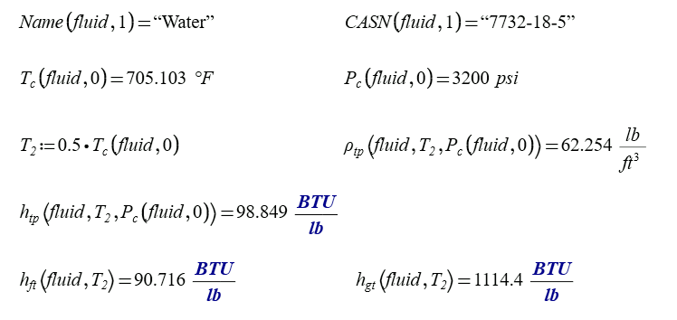

# Mathcad REFPROP Wrapper

Initial Mathcad wrappers (version 2.0) provided here by NNL (J. Henning) with approval. 

This directory contains the source for building the Mathcad 15 and Mathcad Prime wrappers for the NIST RefProp materials library.   This is version 2.0 of the code which makes calls to the REFPROP.dll (or REFPROP64.dll) when NIST RefProp 9.1 or later is installed on the Windows 10 computer.

## Using This Directory as a Git Repository

In order to properly transfer the Mathcad 15 Handbook and Units directory, which consists of many Mathcad worksheets with the `.xmcd` and `.mcdx` file extensions, you will need a `.gitattributes` file (provided in this download) with the following lines in it:  

    *.xmcd binary
    *.xmcdz binary
    *.mdcx binary

While the Mathcad 15 Handbook worksheets are XML and not binary, this attribute will keep git from messing with the CRLF on the line endings in the XML worksheets, corrupting them and making them unusable when committed or transferred to and from a Git remote repository.	

## Building the Mathcad 15 add-in DLL

To build the Mathcad 15 add-in DLL, 

1. Make sure that Mathcad is not running
2. Go to the /build15 directory
3. Use the `MathcadREFPROPwrapper.sln` file to open the solution in VisualStudio 2015 or later.  This will open the MathcadREFPROPwrapper project. 
4. Make sure that the build is set to "**Release**" and target is "**Win32**" (Mathcad 15 is 32-bit) 
5. Select **Build | Rebuild MathcadREFPROPwrapper**
6. This will build the add-in DLL and it will be placed in the Mathcad 15 installation directory under **/userfi**
7. The function interface doc (RefProp_EN.xml) will be copied to the Mathcad 15 installation directory under **/doc/funcdoc**
8. The context sensitive help files will also be copied to the Mathcad 15 installation directory under **/doc/HELP_EN/Refprop**
9. The RefProp Handbook (eBook) files will be copied to the Mathcad 15 installation directory under **/Handbook/Refprop**

## Building the Mathcad Prime Custom Function DLL

To build the Mathcad Prime DLL,

1. Make sure that Mathcad Prime is not running
2. Go to the /buildPrime directory
3. Use the `RefPropPrimeWrapper.sln` file to open the solution in VisualStudio 2015 or later.  This will open the PrimeREFPROPwrapper project. 
4. Make sure that the build is set to "Release" and target is "x64" for a 64-bit build.
5. Select **Build | Rebuild PrimeREFPROPwrapper**
6. This will build the add-in DLL and it will be placed in the Mathcad Prime installation directory under **/Custom Functions**
7. There is no interface file facility for Custom Functions in Prime at this time.

If you have a different version than **Mathcad Prime 6.0.0.0**, you will need to modify the VS project settings under:
    - C++ > General > Additional Include Directories
    - Linker > General > Additional Library Directories
    - Build Events > Post-Build Events
to change the applicable `PTC\Mathcad Prime 6.0.0.0` path strings to the appropriate version for your system.

## Using the RefProp Add-in in either Mathcad 15 or Mathcad Prime

With the Mathcad wrapper DLL compiled and copied to the appropriate Mathcad directories, the RefProp functions,
which all begin with the prefix "rp_", will be directly available for use in Mathcad.  In Mathcad 15, the functions
and usage descriptions will be available in the Insert Function panel under the category **NIST RefProp**.
Unfortunately, Mathcad Prime does not yet have the facility to list custom functions as of Mathcad Prime 6.0.  A User's Guide
for Mathcad Prime can be found in PDF format in the PrimeDocs folder of this repository.  
  
In addition, the file **Units\RefProp_Units** is available for both Mathcad 15 and Mathcad Prime.  By including this reference worksheet in your own worksheets, all of the RefProp functions will be available through pre-defined user functions that provide:
    - Functions in standard mathematical, thermodynamic notation, including Greek symbols and
    - Unit handling to put any parameters in the correct units and return values with units already applied.  
See the documentation (Mathcad 15 Handbook and Mathcad Prime PDF User's Guide) for instructions on using these functions.

 
 
## Electronic Handbook for the RefProp Add-in for Mathcad 15

The files in the /Handbook directory can be copied into the /Handbook subdirectory in the Mathcad 15 installation path.  This copy procedure happens automatically when you compile and link the Mathcad Add-in DLL.  These files will allow the electronic handbook for RefProp to be available from the Mathcad **Help | e-Books** menu under **NIST RefProp**.  This electronic handbook will provide usage instruction and Mathcad usage examples that can be copied and pasted into your own worksheets.
  
For more information on how to use the RefProp functions in either flavor of Mathcad, see [RefProp Help](./doc/HELP_EN/Refprop/RefpropHelp.htm)  

## Possible Future Enhancements

1. Add new interface functions from RefProp 10 (if loaded) in addition to the legacy functions initially provided in version 2.0.
2. Add a CMake build system to dynamically create the \build15 and \buildPrime directories, taking Mathcad and VS versions as parameters for a simpler build.

